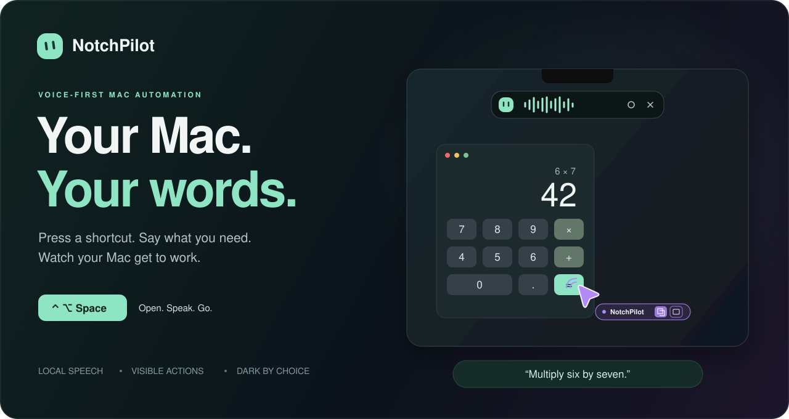

<p align="center">
  
</p>

<p align="center">
  <strong>A little voice strip. A visible helping hand. Your Mac, in your words.</strong>
</p>

<p align="center">
  <a href="https://github.com/codebooker/NotchPilot/actions/workflows/ci.yml"></a>
  
  
  <a href="LICENSE"></a>
</p>

<p align="center">
  <a href="#meet-notchpilot">Meet NotchPilot</a> ·
  <a href="#get-it-running">Get it running</a> ·
  <a href="#make-it-yours">Make it yours</a> ·
  <a href="docs/architecture.md">Under the hood</a> ·
  <a href="#where-it-is-today">Current limits</a>
</p>

<sub>The header is an interface illustration. The cursor preview below is rendered by the app’s native drawing code.</sub>

## Meet NotchPilot

NotchPilot is an experimental, native macOS assistant that turns spoken requests into visible desktop actions. Press **Control–Option–Space**, say what you need, and watch it work in the app you asked for.

It lives in a **280 × 44 point strip below the notch**. The microphone is ready when the strip opens. Waves show that it hears you; a question or short message appears when it needs help. No click-to-talk routine. No large chat window covering your work.

The idea is simple: make everyday computer tasks easier to ask for—whether you want fewer clicks, prefer speaking, or find conventional interfaces difficult to use. Accessibility is a design motivation; this is still a prototype, not an independently validated accessibility product.

> **Source preview, not a finished download.** This repository contains the working prototype and its tests. Build it on your own Mac; there is no portable, notarized installer yet. General computer-use reliability is still being improved.

### Small on screen. Thoughtful in use.

| | What you get |
|---|---|
| **Talk naturally** | Local Whisper `base.en` transcribes speech. Optional local Qwen3 1.7B helps interpret casual phrasing and asks for missing details. |
| **Keep the conversation going** | Say another request while it works. Follow-ups queue in order, with recent successful tasks as context. |
| **See what happens** | The working app comes forward. A rounded lavender cursor shows the target, action feedback, and a compact NotchPilot badge. |
| **Take your time** | Choose a one-, two-, or three-second speaking pause. Changing it does not cut off the phrase in progress. |
| **Stay in control** | Cancel a task without closing the mic. Review and clear queued requests. Pause Cua while you type, then resume. |
| **Keep your retinas** | Dark, Light, or Follow System for conversation and settings. The voice strip stays dark. |
| **Download once** | Install the local speech and interpretation models from Settings with progress, cancellation, and checksum verification. |
| **Choose the engine** | Cua is the default. Jev remains an experimental option with TypeSafe or OpenRouter support. |

### Try a small request first

```text
“Open Finder.”
“In Calculator, calculate six times seven.”
“Open a new tab in Google Chrome and go to example.com.”
“Open Finder, then open Calculator, then open Safari.”
```

With a text document open, try **“Write The sun was shining.”** Another “write…” request adds text at the caret while preserving existing content. Use **“type exactly…”** when spacing must stay literal. Plain dictation uses a local insertion path when one document text area is available; composing new prose is a separate option in Advanced.

These describe exercised task types, not a guarantee that every app or phrasing will work. Start with one clear request, then build up to a short sequence.

<p align="center">
  
  <br><sub>A small pointer with smooth movement and action feedback. The overlay lets clicks pass through.</sub>
</p>

## Get it running

### 1 · Bring the essentials

- **An Apple Silicon Mac running macOS 14 or later.** The default local interpreter uses MLX. Intel Macs are not a supported setup target.
- **Xcode Command Line Tools**, including Swift and Git. Install with `xcode-select --install` if needed.
- **Python 3, [uv](https://docs.astral.sh/uv/), and CMake.** Setup uses uv to create a Python 3.12 environment.
- An internet connection for dependencies and model downloads, plus enough disk space for the runtimes and roughly **1.1 GB of model downloads**.
- An **OpenRouter API key** for the default online controller. You do not need a key to build or run the unit tests.

If you already use Homebrew:

```sh
brew install uv cmake
```

### 2 · Build the app

```sh
git clone https://github.com/codebooker/NotchPilot.git
cd NotchPilot
python3 NotchPilot/setup.py
open NotchPilot/build/NotchPilot.app
```

Setup fetches pinned upstream revisions, creates an isolated runtime in `.cache`, compiles Whisper, and builds/signs the native app. Model weights are downloaded separately from the app’s Settings screen.

**Keep this checkout in place.** The prototype references its local Python runtime, Whisper executable, and models. Moving only the `.app` to another Mac will not bring those dependencies with it.

### 3 · Finish the first-run setup

In **Settings → Setup**:

1. Allow **Microphone**, **Accessibility**, and **Screen Recording** for NotchPilot. The app explains the access it needs and links to the relevant macOS settings.
2. Choose **Download essentials** to install Whisper `base.en` and Qwen3 1.7B. Each model can also be repaired separately under Advanced.
3. Paste your **OpenRouter API key** and choose **Save key**. The app stores it in macOS Keychain.
4. Choose **Start talking**, or press **Control–Option–Space**.

The default Cua route does **not** require Chrome remote debugging. A separate, experimental Browser Harness flight path does; it is not required for ordinary use.

<details>
<summary><strong>Keys, signing, and rebuilds</strong></summary>

For development, an ignored root `.env` can provide fallback keys. Copy `.env.example` and fill in only the service you intend to use. Keys saved through the app take precedence.

```sh
cp .env.example .env
```

After changing the source, rebuild with the prepared runtime:

```sh
.cache/notch-venv/bin/python NotchPilot/build.py
```

The build remembers an available **Apple Development** signing identity to keep macOS permission attribution stable. Without one it uses ad-hoc signing; subsequent code changes may require renewed permission approval. You can explicitly select an identity with `NOTCHPILOT_SIGNING_IDENTITY`. The build does not export signing keys or notarize the app.

Quit the existing app before rebuilding, then reopen it. If Screen Recording was just enabled, quit and reopen once more. For more help, see [Troubleshooting](docs/troubleshooting.md).

</details>

## Make it yours

Open the gear → **Everyday**.

| Setting | Your choice |
|---|---|
| **Appearance** | Dark, Light, or Follow System. Saved across launches. |
| **Your shortcut** | Change the default **Control–Option–Space** to a combination you prefer. |
| **Time to finish speaking** | Quick · 1 second, Relaxed · 2 seconds, or Unhurried · 3 seconds. |
| **Close when the task is finished** | Close after successful work and a short grace period, or keep listening for the next request. |
| **Strip position** | Drag it out of the way, or move it back below the notch. |

Questions, errors, pending speech, and an open conversation/settings window prevent automatic closing. The microphone stays active while ordinary commands run.

### A few words worth knowing

| Say or do | What happens |
|---|---|
| **“Cancel that”** or **“Never mind”** | Stops the current task and its follow-ups; keeps listening and remembers earlier successful requests. It does not undo completed changes. |
| **“Clear the queue”** | Drops waiting requests and pending untranscribed audio. The current task continues. |
| **“Resume task”** | Continues Cua work after reviewing the conversation/settings. |
| **“Stop”**, **Escape**, the hotkey, or **×** | Ends the session and stops active/queued work. Spoken stop takes effect after transcription; keyboard stop is immediate. |
| **Click the strip’s center** | Opens the conversation with the current request, waiting requests, optional typed input, and details. |

Opening the conversation during Cua work pauses between actions before the editor takes keyboard focus. Add a follow-up with **Add next**, clear waiting requests, and select **Resume task** when ready. Short native operations and experimental Jev routes may finish before the review window opens.

## Local voice. Online decisions.

NotchPilot combines small local models with a desktop controller. It is **not entirely offline**.

| Component | Runs where | Role |
|---|---|---|
| **Whisper base.en** | On your Mac | English speech recognition; approximately 148 MB download. |
| **Qwen3 1.7B, 4-bit MLX** | On your Mac | Optional request interpretation and clarification; approximately 984 MB download. |
| **Cua Driver 0.28.2** | On your Mac | Reads native controls and delivers bounded desktop actions. |
| **GPT-5 mini via OpenRouter** | Online | Default Cua action decisions; optional text composition. API usage is billed by the provider. |
| **Jev via TypeSafe or OpenRouter** | Online, experimental | Alternative finite-choice controller. It is not used by the default Cua path. |

Certain literal browser/folder requests and small Calculator operations use local paths without controller API calls. That does not make arbitrary computer use free: other tasks need online decisions, and inference is only part of their total latency.

**Privacy in practical terms:** voice transcription runs locally. During online tasks, your request and observed app text are sent to the selected service. Normal runs do not retain command transcripts or screenshots; temporary audio/captures are removed after use. API keys stay in Keychain or your ignored `.env`. Developer tracing is opt-in and can contain screen text. Read the [data flow and architecture](docs/architecture.md) before enabling it.

## Where it is today

This is a working experiment with a growing test suite, not a claim that every desktop workflow is solved.

**Exercised locally:** opening apps, literal browser tabs/URLs, simple verified Calculator arithmetic, TextEdit document creation and editing/saving an existing test file, short app chains, queue controls, pause/resume, cancellation, and dark mode.

**Still needs work:**

- Long or open-ended workflows can stall or exceed model limits. A model’s “done” is not independent proof of arbitrary task completion.
- Attached dialogs, Save As, custom widgets, and general browser research remain uneven.
- Finder can reach a folder while exposing an unresolvable file URL; NotchPilot then reports an unverified location instead of claiming success.
- English and the primary display are the current supported target. The pointer overlay is not an independent input seat; some actions still use system input.
- Packaging, onboarding, and broader accessibility testing need work before this can be a dependable everyday assistant for everyone.

See [Testing](docs/testing.md) for what was checked and how to reproduce the automated checks. Reports of specific, reproducible failures are welcome in [Issues](https://github.com/codebooker/NotchPilot/issues).

## For builders

The app UI is SwiftUI/AppKit. The controller, local interpreter bridge, and native/browser adapters are Python. There is no web UI or Electron shell.

```text
NotchPilot/
├── Sources/             Swift UI, microphone, permissions, keyboard, cursor
├── Tests/               Native voice/session checks
├── worker.py            Host protocol and action routing
├── cua_agent.py         Default Cua controller
├── planner.py           Local Qwen interpretation
├── navigation.py        Native browser navigation
├── download_models.py   Pinned downloads and checksum verification
├── setup.py             Prepare dependencies and build
└── build.py             Compile and sign the local app
```

After setup:

```sh
.cache/notch-venv/bin/python -B -m unittest discover -s NotchPilot -p 'test_*.py'
```

The published snapshot has **91 passing Python tests**, plus native voice and session checks. CI runs model-free Python tests, Swift typechecking, and voice segmentation/audio conversion; it does not drive a real desktop or call paid models.

Read [CONTRIBUTING](CONTRIBUTING.md), [Architecture](docs/architecture.md), and [Testing](docs/testing.md) before changing input delivery, microphone behavior, or cancellation.

## Built on good work

- [Cua](https://github.com/trycua/cua) — native computer-use infrastructure.
- [whisper.cpp](https://github.com/ggml-org/whisper.cpp) — local speech recognition.
- [MLX LM](https://github.com/ml-explore/mlx-lm) and [Qwen](https://huggingface.co/mlx-community/Qwen3-1.7B-4bit) — local request interpretation.
- [TypeSafe computer use](https://github.com/awlevin/typesafe-computer-use) and [Jev ultrafast](https://github.com/browser-use/jev-ultrafast) — foundations for the experimental Jev paths.

NotchPilot is licensed under the repository’s existing **[GNU AGPL v3](LICENSE)**. Third-party components and model weights retain their own licenses; see [Third-party notices](THIRD_PARTY_NOTICES.md).

---

<p align="center"><strong>Less hunting for buttons. More saying what you mean.</strong></p>
