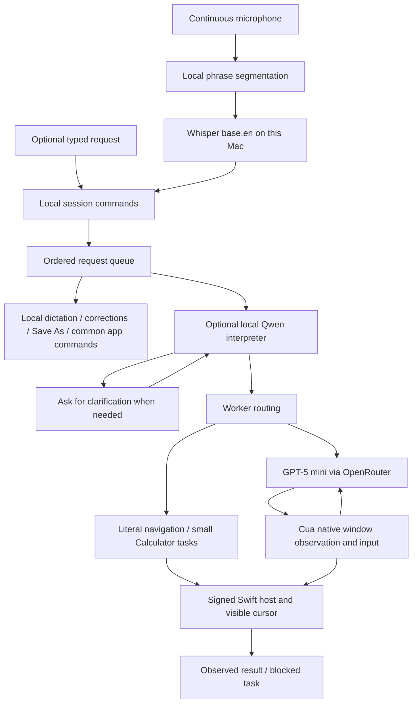

# How NotchPilot works

The native app owns the session. Helpers choose or deliver actions; they do not own the microphone, permissions UI, stop controls, or visible cursor.

## Voice and context

`SpeechCapture.swift` keeps a single AVAudioEngine input tap open. It continuously resamples microphone data to mono 16 kHz and sends 512-sample frames to a signed, resident `vad-session` helper using Silero VAD v6.2.0. The VAD probability, not audio level, marks speech. `VoiceCore.swift` then applies the selected one-, two-, or three-second pause to make a phrase. A separate signed resident `whisper-session` helper receives completed WAV segments and loads base.en once. Decoding context is reset for each phrase; model weights remain warm. `WhisperSession.swift` tracks request IDs, drops cancelled callbacks, and resets the helper after a 90-second timeout. Dictation mode permits an unbroken phrase up to 120 seconds, versus 30 seconds in command mode; longer phrases are discarded through the next pause rather than executing an incomplete request. [Speech detection details](speech-detection.md) explain the local model and its limits.

Exact session commands (stop, cancel that, clear the queue, resume task while reviewing) are handled locally before model interpretation. The queue accepts up to eight waiting requests and retains the last six successful resolved goals as context. Failures clear dependent follow-ups and stale audio. Task cancellation preserves earlier successful context; full session stop clears it.

The optional Qwen3 1.7B interpreter runs as a resident MLX process with offline model loading, without API keys or an HTTP listener. It receives recent goals and bounded accessibility context. Execute/clarify responses are validated, but validation is not a proof that every paraphrase preserves intent.

## Desktop control

The default path embeds Cua Driver 0.28.2 inside the app’s signing/permission chain. GPT-5 mini via OpenRouter chooses actions using bounded native accessibility text and observed element tokens. Native observations and input occur on the Mac. The default path does not call Jev, attach a browser profile, or enable Chrome debugging.

A small set of exact requests can use local routes. Literal URLs in a named browser use native tab/address controls and check the resulting web-area URL. An explicit request such as “open a new tab in Chrome, go to YouTube, and find me a funny cat video” skips Qwen and the Cua decision loop: it opens the requested tab, searches YouTube, chooses an observed `/watch` result using the request words, and verifies the video page. It does not invent a video, use browser debugging, or make a model/API call. Existing absolute folder paths open through NSWorkspace and require observable location evidence. Small positive-integer addition/multiplication uses fresh Calculator buttons and verifies both expression and result.

Clicks on observed buttons, checkboxes, radio buttons, and disclosure triangles that support AXPress are pressed by the signed host (`host_press`) instead of Cua's click, which waits about a second per press trying to verify its effect. The host presses only the unique control with the observed role and frame in the front window; anything else falls back to the Cua click. The controller observes the window after every press as before. On Calculator this cut five clicks from about 5.8 s to 0.12 s ([measurements](../NotchPilot/experiments/results/host-press.json)). The Cua controller can batch up to seven follow-up clicks on already-observed controls. Each is rebound to a fresh token after a new observation; unexpected surface changes discard the remaining sequence. Explicit “then” stages advance after an observed completion. Each stage has a 24-step allowance, within a 72-step task cap, 180 seconds of active work, and the existing API budget. Loop detection resets at verified stage boundaries so an explicitly repeated instruction is allowed. Empty accessibility observations get two short read-only retries, then stop with a clear message instead of paying for repeated model decisions. Host checks cover supported keys, foreground process/window identity, editable-field focus, and cancellation generation. These checks limit stale input; they cannot make arbitrary model judgments infallible.

Literal “write…” / “type…” requests preserve their text without Qwen rewriting. The host carries the current app and exact window into follow-up requests. When Cua observes one document text area, literal dictation inserts through the signed host at the actual accessibility selection, verifies the resulting whole value, and preserves the rest of the document. Ordinary insertion adds a word boundary where needed; “type exactly” preserves exact spacing. This path makes no online model calls. Composition requests and ambiguous interfaces retain the controller path.

`VoiceActions.swift` routes explicit dictation/correction, common app, key-navigation, and Save As commands before Qwen. `VoiceEditing.swift` binds continuous dictation to a document window, uses unique phrase matching, and stores up to 20 verified edits for guarded scratch/undo. Native Save As handles standard dialog identifiers, protects existing destinations, and requires a saved file plus the matching document URL. Sleep mode ignores ordinary speech while retaining the microphone for wake-up. These are bounded local paths; unsupported editors still need the controller or user. See [Hands-free use](hands-free.md).

S1 Forms is an isolated experiment, not part of the production routing graph. Its model results and the unresolved delivery-adapter work are recorded in [the evaluation](cua-s1-evaluation.md).

## Review, stop, and cursor

Opening the conversation/settings during Cua work requests a checkpoint pause. The editor waits until an action boundary before taking focus. Resume releases the checkpoint; active-work timeout accounting excludes review waits. Cancelling closes the worker’s input pipe and invalidates its generation so delayed events cannot resume input. Native shortcuts and the legacy Jev path have fewer checkpoints and can finish before the review window opens.

The cursor is a native click-through overlay: an approximately 26 × 28 point rounded lavender pointer with small action marks and a click pulse, and no text badge. Motion takes roughly 0.24–0.52 seconds, with input gated on arrival. macOS Reduce Motion disables motion animation. This is a visible overlay, not a separate input seat.

## Engines and keys

| Engine | Service | Model |
|---|---|---|
| Cua, default | OpenRouter | `openai/gpt-5-mini` |
| Jev, experimental | TypeSafe | `jev-latest` |
| Jev, experimental | OpenRouter | `~typesafe/jev-latest` |
| Optional composition | OpenRouter | GPT-5 mini |

**Decision model** (Settings → Advanced, Cua only) chooses what the Cua controller asks. Measured on a short two-decision Calculator task: GPT-5 mini (default, fastest provider) about $0.0019 and 10.1 s; Gemini 2.5 Flash-Lite (cheapest provider) about $0.0006 and 6.4 s; GPT-5 nano (cheapest provider) about $0.0004 and 13.9 s; DeepSeek V4 Flash about $0.0009 and 8.8 s. DeepSeek uses its fastest provider because the cheapest one took 12–15 s per decision. One run each, so these are price and speed measurements, not accuracy evidence ([results](../NotchPilot/experiments/results/decision-models.json)). Requests require providers that honor the output schema.

Each decision sends a compact view of the window: containers and the system-wide Services submenu are dropped, default flags are omitted, and long element tokens become short ids mapped back afterwards. The fixed instructions, installed apps, and key names come first so providers can cache them. On a real Calculator window this halved the input tokens per decision (about 5,000 to 2,600).

A warm worker is started after permissions are confirmed and after each task: the Python worker starts the Cua driver and waits for a request, so the next task starts in about 0.01 s. It is adopted only if its arguments and keys still match current settings; otherwise it is replaced. The app logs its own stage timings (interpretation, worker start, first event, total) into the same local performance log, under the worker's run id.

**Browsers.** Chrome's address bar shows text inserted through Accessibility but ignores it, so Return did nothing. In Chromium browsers the host types into the observed field with real keystrokes (`host_type`), focusing it through Accessibility or, for fields inside a page, with a click that must land inside the target window; an address bar is replaced, and `key: enter` on a type action submits. After a submit, the controller waits (up to 6 s) for a new title and for the page itself to reach the accessibility tree before the next decision, and reads up to 600 elements of an incomplete browser window. The model does not see controls outside the window, nested duplicate links and text, or the History, Bookmarks, Window, Tab, and Profiles menus, which list visited pages and bookmarks. Without online composition, typed text must be the user's own words in any order (singular or plural); other text is refused as feedback to the model rather than ending the task. Verified once end to end: "Go to youtube.com and find me a video about dogs" reached YouTube's results for "dogs" with Gemini 2.5 Flash-Lite; the latest menu and page-presence changes are unit-tested but were not re-run live.

The chosen provider does not silently fall back to another. Keys saved in Keychain take precedence over project `.env` keys. The host passes credentials through the helper environment, never command-line arguments or the app bundle. Qwen is an interpreter, not the optional online writer.

## Data and diagnostics

- Speech recognition is local. Temporary utterance audio is deleted after transcription or cancellation.
- Online decisions send the request and observed app text to the chosen service. Sensitive text visible in a targeted app may therefore enter that service’s context.
- Default Cua observations use native accessibility state. The legacy Jev route can use local OCR/screenshots; ScreenCaptureKit excludes NotchPilot’s windows, and temporary captures are removed after processing.
- Normal performance records in `.cache/notchpilot-performance.jsonl` contain timing/usage rather than requests or screen contents.
- A developer can enable richer tracing with `.cache/notchpilot-trace-enabled`. Those traces may contain screen text. Keep them private, disable tracing after debugging, and inspect anything before sharing it.
- No model weights, keys, private signing identities, runtime caches, or local run logs belong in Git.

## Runtime and distribution

Setup pins upstream revisions in `NotchPilot/setup.py`, package versions in that script, and model files/checksums in `NotchPilot/models.json`. Builds record runtime revisions in the ignored `NotchPilot/build/runtime-versions.json`. Transitive Python dependencies are resolved during setup; this is not a fully locked or hermetic distribution.

The app currently references its checkout’s runtime paths. It is locally signed, not a standalone notarized distribution. Preserve the checkout when using it, and keep a stable signing identity across rebuilds where available.
