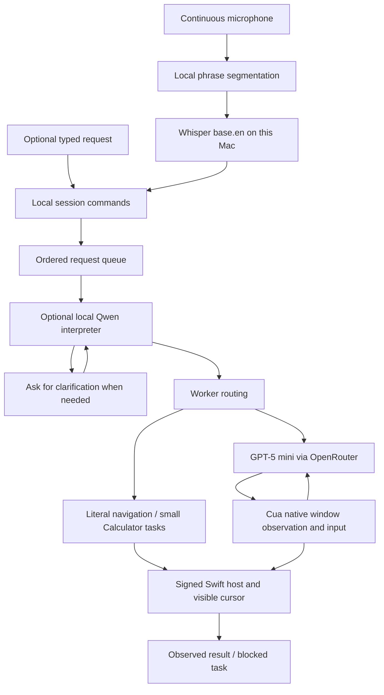

# How NotchPilot works

The native app owns the session. Helpers choose or deliver actions; they do not own the microphone, permissions UI, stop controls, or visible cursor.

## Voice and context

`SpeechCapture.swift` keeps a single AVAudioEngine input tap open. `VoiceCore.swift` segments phrases at the selected one-, two-, or three-second pause. Whisper receives mono 16 kHz WAV segments. Silence does not end a session; a phrase over 30 seconds is discarded through the next pause rather than executing an incomplete request.

Exact session commands (stop, cancel that, clear the queue, resume task while reviewing) are handled locally before model interpretation. The queue accepts up to eight waiting requests and retains the last six successful resolved goals as context. Failures clear dependent follow-ups and stale audio. Task cancellation preserves earlier successful context; full session stop clears it.

The optional Qwen3 1.7B interpreter runs as a resident MLX process with offline model loading, without API keys or an HTTP listener. It receives recent goals and bounded accessibility context. Execute/clarify responses are validated, but validation is not a proof that every paraphrase preserves intent.

## Desktop control

The default path embeds Cua Driver 0.28.2 inside the app’s signing/permission chain. GPT-5 mini via OpenRouter chooses actions using bounded native accessibility text and observed element tokens. Native observations and input occur on the Mac. The default path does not call Jev, attach a browser profile, or enable Chrome debugging.

A small set of exact requests can use local routes. Literal URLs in a named browser use native tab/address controls and check the resulting web-area URL. Existing absolute folder paths open through NSWorkspace and require observable location evidence. Small positive-integer addition/multiplication uses fresh Calculator buttons and verifies both expression and result.

The Cua controller can batch up to seven follow-up clicks on already-observed controls. Each is rebound to a fresh token after a new observation; unexpected surface changes discard the remaining sequence. Explicit “then” stages advance after an observed completion. Each stage has a 24-step allowance, within a 72-step task cap, 180 seconds of active work, and the existing API budget. Loop detection resets at verified stage boundaries so an explicitly repeated instruction is allowed. Empty accessibility observations get two short read-only retries, then stop with a clear message instead of paying for repeated model decisions. Host checks cover supported keys, foreground process/window identity, editable-field focus, and cancellation generation. These checks limit stale input; they cannot make arbitrary model judgments infallible.

## Review, stop, and cursor

Opening the conversation/settings during Cua work requests a checkpoint pause. The editor waits until an action boundary before taking focus. Resume releases the checkpoint; active-work timeout accounting excludes review waits. Cancelling closes the worker’s input pipe and invalidates its generation so delayed events cannot resume input. Native shortcuts and the legacy Jev path have fewer checkpoints and can finish before the review window opens.

The cursor is a native click-through overlay with an approximately 26 × 28 point rounded lavender pointer and a compact identity badge. The badge uses observed delivery/app metadata; edge placement does not change the input hotspot. Motion takes roughly 0.24–0.52 seconds, with input gated on arrival. macOS Reduce Motion disables motion animation. This is a visible overlay, not a separate input seat.

## Engines and keys

| Engine | Service | Model |
|---|---|---|
| Cua, default | OpenRouter | `openai/gpt-5-mini` |
| Jev, experimental | TypeSafe | `jev-latest` |
| Jev, experimental | OpenRouter | `~typesafe/jev-latest` |
| Optional composition | OpenRouter | GPT-5 mini |

The chosen provider does not silently fall back to another. Keys saved in Keychain take precedence over project `.env` keys. The host passes credentials through the helper environment, never command-line arguments or the app bundle. Qwen is an interpreter, not the optional online writer.

## Data and diagnostics

- Speech recognition is local. Temporary utterance audio is deleted after transcription or cancellation.
- Online decisions send the request and observed app text to the chosen service. Sensitive text visible in a targeted app may therefore enter that service’s context.
- Default Cua observations use native accessibility state. The legacy Jev route can use local OCR/screenshots; ScreenCaptureKit excludes NotchPilot’s windows, and temporary captures are removed after processing.
- Normal performance records in `.cache/notchpilot-performance.jsonl` contain timing/usage rather than requests or screen contents.
- A developer can enable richer tracing with `.cache/notchpilot-trace-enabled`. Those traces may contain screen text. Keep them private, disable tracing after debugging, and inspect anything before sharing it.
- No model weights, keys, private signing identities, runtime caches, or local run logs belong in Git.

## Runtime and distribution

Setup pins upstream revisions in `NotchPilot/setup.py`, package versions in that script, and model files/checksums in `NotchPilot/models.json`. Builds record runtime revisions in the ignored `NotchPilot/build/runtime-versions.json`. Transitive Python dependencies are resolved during setup; this is not a fully locked or hermetic distribution.

The app currently references its checkout’s runtime paths. It is locally signed, not a standalone notarized distribution. Preserve the checkout when using it, and keep a stable signing identity across rebuilds where available.
